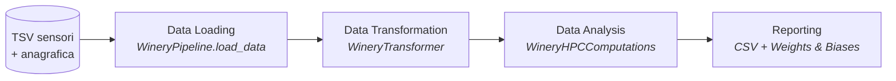
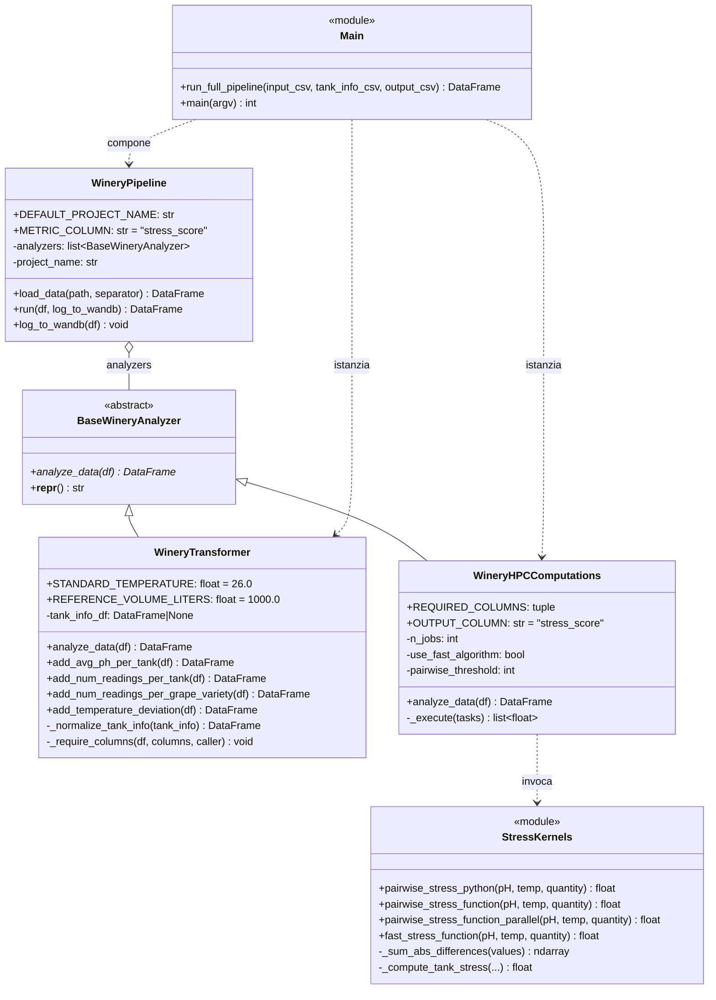
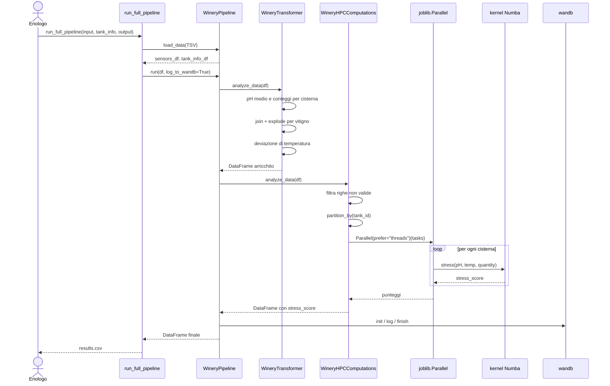
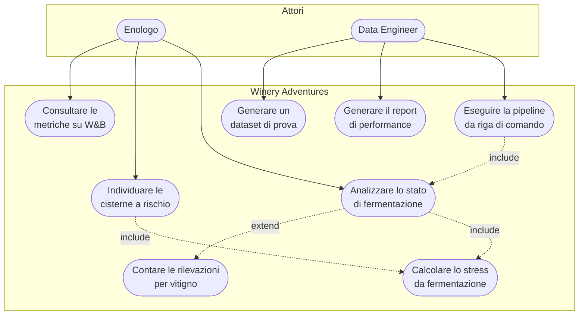

# Architettura del sistema

Questo documento descrive la struttura di Winery Adventures e le scelte di
progetto che la sostengono. I diagrammi sono in Mermaid, così da essere
renderizzati direttamente da GitHub; le versioni PlantUML, più dettagliate,
sono in [`docs/uml/`](uml/) e si generano con `plantuml docs/uml/*.puml`.

## Visione d'insieme

Il sistema è una pipeline a stadi. Ogni stadio riceve un `polars.DataFrame`,
lo arricchisce e lo passa al successivo. L'orchestratore non conosce i tipi
concreti degli stadi: dipende solo dal contratto astratto
`BaseWineryAnalyzer`.

## Diagramma delle classi

## Diagramma di sequenza

## Diagramma dei casi d'uso

## Scelte di progetto

### Perché una classe astratta e non semplici funzioni

Ogni stadio della pipeline espone lo stesso metodo `analyze_data(df) -> df`.
Questo permette a `WineryPipeline.run()` di essere un ciclo di tre righe, del
tutto indipendente dagli stadi concreti: si possono aggiungere fasi (per
esempio un rilevatore di anomalie) senza toccare l'orchestratore. È il
principio aperto/chiuso applicato al caso più semplice possibile.

### Perché la deviazione di temperatura è normalizzata sul volume

Una deviazione di 2 °C in una cisterna da 500 litri è ben più preoccupante
della stessa deviazione in una da 2000 litri: la massa termica maggiore rende
la fermentazione più stabile. La normalizzazione su 1000 litri rende
confrontabili cisterne di taglia diversa.

### Perché due livelli di parallelismo

Il calcolo dello stress è indipendente cisterna per cisterna: è quindi
parallelizzabile "in orizzontale" con joblib. Poiché i kernel Numba rilasciano
il GIL (`nogil=True`), il backend a **thread** è preferibile a quello a
processi: niente serializzazione degli array, niente copie di memoria. Per il
caso limite di una singola cisterna con milioni di rilevazioni resta
disponibile `pairwise_stress_function_parallel`, che parallelizza il ciclo
interno con `prange`.

### Perché tre implementazioni della stessa formula

`pairwise_stress_python` è la traduzione letterale della specifica e funge da
oracolo di correttezza. `pairwise_stress_function` è la stessa formula
compilata JIT: dimostra il guadagno dovuto al solo Numba, a parità di
algoritmo. `fast_stress_function` cambia l'algoritmo e porta il costo da
$O(n^2)$ a $O(n \log n)$. Tenerle tutte e tre permette di misurare separatamente il
contributo della compilazione e quello della riprogettazione algoritmica, ed è
esattamente ciò che il report di performance mostra.

Il dettaglio della fattorizzazione algebrica è documentato nella docstring di
`fast_stress_function`; l'idea è che, essendo $D_{ij}$ simmetrico,

$$\sum_{i,j} D_{ij} (w_i + w_j) = 2 \sum_i w_i \sum_j D_{ij}$$

e la somma interna $\sum_j |x_i - x_j|$ si calcola per tutti gli $i$ in un'unica
passata su dati ordinati, tramite somme prefisse.
### Gestione dei dati mancanti

Il generatore di dati produce circa il 10% di letture con `quantity_liters`
nullo. Le righe con valori mancanti vengono escluse dal calcolo dello stress
ma **restano** nel DataFrame di output: manca il dato, non la lettura.
Sostituire i null con una media inventerebbe informazione e falserebbe una
formula che misura proprio la variabilità.
